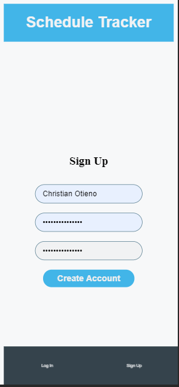
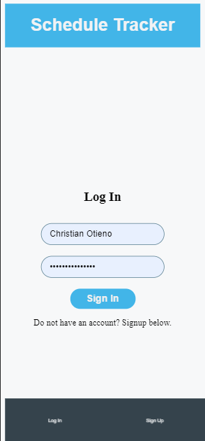
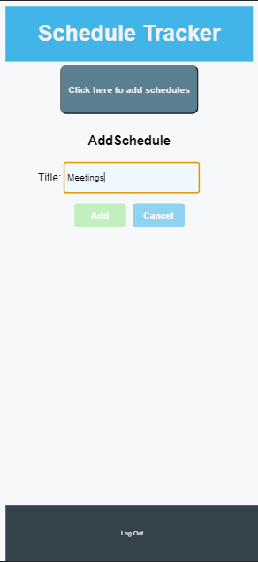
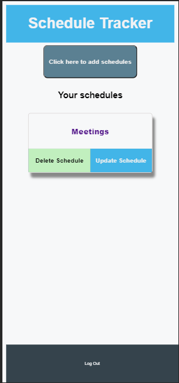
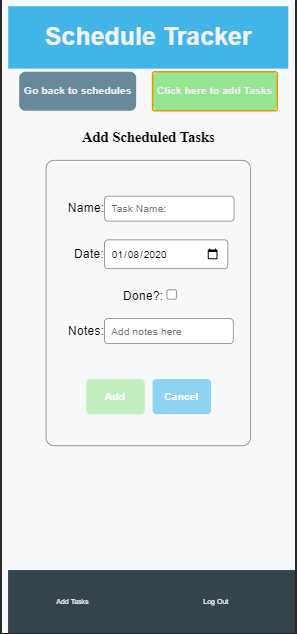

# Schedule Tracker

## About the project

This project involved creating a tracking App in which a user is presented with a list of things to be measured.
For the Front End, I used React and Ruby on Rails for the Back-End API.

1. ## Screenshots

|Name|Screenshot|
|:---|:---:|
|Sign up||
|Sign in||
|Add Schedules||
|Schedules||
|tasks||

## 2. Built With

- [React JS](https://reactjs.org/)
- [Chrome web Browser.](https://www.google.com/chrome/?brand=CHBD&gclid=CjwKCAjwqJ_1BRBZEiwAv73uwMy_V_6pha6yTVEa8JtU5T51QdyxZOVnsXlRndK05hSO4bSM6muP5RoC2E4QAvD_BwE&gclsrc=aw.ds)
- [Netlify](https://www.netlify.com/) for deployment.
- [HTML/DOM](https://www.w3schools.com/js/js_htmldom.asp) - Manipulation for UI.
- [Eslint](https://eslint.org/) for linter checks and style guides.

## 3. Pre-requisites

- A code editor.
- Chrome Web Browser.
- Have NodeJS installed locally.
- Basic to intermediate JavaScript skills.

## 4. Future feature updates/improvements

- The upcoming updates will consist of:

1. Ability to measure indepth a task by adding timers like pomodoro.
2. Functionality to allow user to interact with graphs based on the input tasks.
3. A more revamped user interface to filter out results based on the user's search and preferences of tasks.

**Below are the instructions on how to play the game and also setting it up locally.**

### Build Dependencies 🚧

***The only dependencies are NodeJS & yarn. Any NodeJS LTS version will work. Clone this repo and run npm install.***

- To get a local copy up and running, follow these simple example steps.

### Setup and installation

```
git@github.com:christianotieno/tracker-client.git
```

### Install dependencies

```
yarn install
```

### Run the app in the development mode

```
yarn start
```

Open [http://localhost:3000](http://localhost:3000) to view it in the browser.

### Run linter checks

```
npx eslint .
```

### Deployment

```
yarn build
```

The command builds the app for production to the `build` folder.
It correctly bundles React in production mode and optimizes the build for the best performance.

The build's minified and the filenames include the hashes.
Your app is ready to be deployed!

|  APP NAME | BUILD STATUS: |
|   :---:   |    :---:     |
|**tracker-client** |  [](https://app.netlify.com/sites/react-shedule-tracker-app/deploys)|

---

## 7. Live link

[Link to Live Page](https://relaxed-edison-1912f3.netlify.app/signup)

---

## 8. Author Section

👤 **Christian Otieno**

- Github: [christianotieno](https://github.com/christianotieno)
- Twitter: [@iamchrisotieno](https://twitter.com/iamchrisotieno)
- LinkedIn: [Christian Otieno](https://www.linkedin.com/in/christianotieno/)

---

## 9. 🤝 Contributing

Contributions, issues and feature requests are welcome!

Feel free to check the [issues page](https://github.com/christianotieno/tracker-client/issues).

---

## 10. Show your support

Give a ⭐️ if you like this project!

---

### Credits

- Microverse
